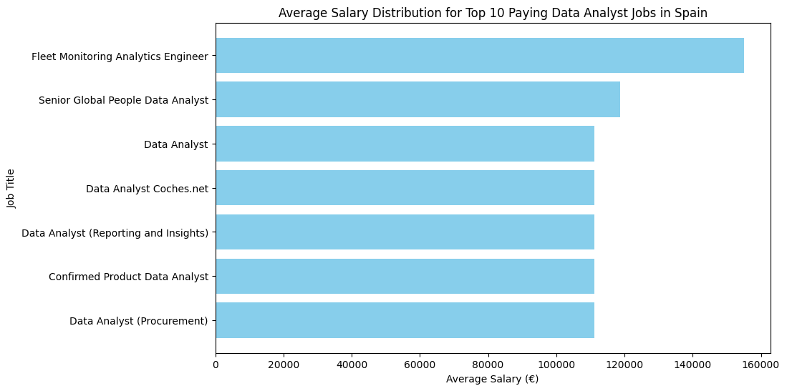

# Introduction
Dive into the data job market in Spain! Focusing on data analyst roles, this project explores top-paying jobs, in-demand skills, and where high demand meets high salary in data analytics.

SQL queries? Check them out here: [Project_SQL folder](/Project_SQL/)
# Background
Driven by a quest to navigate the data analyst job market in Spain more effectively, this project was born from a desire to pinpoint top-paid and in-demand skills, streamlining other's work to find optimal jobs.
### The questions I wanted to answer through my SQL queries were:
1. What are the top-paying data analyst jobs in Spain?
2. What skills are required for these top-paying jobs?
3. What skills are most in demand in Spain for data analysts?
4. Which skills are associated with higher salaries?
5. What are the most optimal skills to learn?

# Tools I Used
For my deep dive into the data analyst job market in Spain, I harnessed the power of several key tools:

- **SQL:** The backbone of my analysis, allowing me to query the database and unearth critical insights.
- **PostgreSQL:** The chosen database management system, ideal for handling the job posting data.
- **Visual Studio Code:** One of the best for database management and executing SQL queries.
- **Git & Github:** Essential for version control and sharing my SQL scripts and analysis, ensuring collaboration and project tracking.
# The Analysis
### 1. Top Paying Data Analyst Jobs in Spain
To identify the highest-paying roles, I filtered data analyst positions by average yearly salary and location, focusing on jobs in Spain. This query highlights the high paying opportunities in the field.

```sql
SELECT 
    job_id,
    job_title,
    job_location,
    job_schedule_type,
    salary_year_avg,
    job_posted_date,
    name AS company_name
FROM    
    job_postings_fact
LEFT JOIN company_dim ON job_postings_fact.company_id = company_dim.company_id
WHERE job_location LIKE '%Spain' AND job_title_short = 'Data Analyst' AND salary_year_avg IS NOT NULL
ORDER BY salary_year_avg DESC
LIMIT 10;
```
Here's the breakdown of the top analyst jobs in Spain for 2023:
- **Wide Salary Range:** The salary range for data analyst positions in Spain varies from €105,000 to €155,000 per year indicating salary potential in the field.
- **Company Diversity:** The job postings come from a variety of companies, including consulting firms like Capgemini, insurance companies like Allianz, digital agencies like Netcentric and Publicis Groupe, and tech startups like PayFit and Octopus Energy. This reflects the diverse range of industries and sectors that require data analysis expertise.
- **Job Title Specificity:** Job titles vary from generic "Data Analyst" to more specialized roles like "Fleet Monitoring Analytics Engineer" and "Data Analyst (Procurement)." This suggests a range of responsibilities and focuses within the field of data analysis.


*Bar graph visualizing the salary for the top 10 salaries for data analysts; ChatGPT generated this graph from my SQL query results.*

### 2. Top Skills for Top-Paying Jobs
To understand what skills are required for the top-paying jobs, I joined the job postings with the skills data, providing insights into what employers value for high-compensation roles.

```sql
WITH top_paying_spain_jobs AS (
    SELECT 
        job_id,
        job_title,
        job_location,
        salary_year_avg,
        name AS company_name
    FROM    
        job_postings_fact
    LEFT JOIN company_dim on job_postings_fact.company_id = company_dim.company_id
    WHERE job_location LIKE '%Spain' AND job_title_short = 'Data Analyst' AND salary_year_avg IS NOT NULL
    ORDER BY salary_year_avg DESC
    LIMIT 10
)

SELECT top_paying_spain_jobs.*,
        skills_dim.skills
FROM top_paying_spain_jobs
INNER JOIN skills_job_dim ON top_paying_spain_jobs.job_id = skills_job_dim.job_id
INNER JOIN skills_dim ON skills_job_dim.skill_id = skills_dim.skill_id
ORDER BY salary_year_avg DESC
```

Here's the breakdown of the most demanded skills for the top 10 highest paying data analyst jobs in Spain for 2023:

1. **SQL & Python:** Are tied and leading the overall count, with 5 occurrences each.
3. **Pandas & Looker:** follows SQL & Python with 3 occurrences each.


*Bar graph visualizing the count of skills for the top 10 paying jobs for data analysts in Spain; ChatGPT generated this graph from my SQL query results.*

### 3. In-Demand Skills for Data Analysts
This query helped identify the skills most frequently requested in job postings, specifically in Spain, directing focus to areas with high demand.

```
SELECT skills,
        COUNT(skills_job_dim.job_id) AS demand_count
FROM job_postings_fact
INNER JOIN skills_job_dim ON job_postings_fact.job_id = skills_job_dim.job_id
INNER JOIN skills_dim ON skills_job_dim.skill_id = skills_dim.skill_id
WHERE job_location LIKE '%Spain' AND job_title_short = 'Data Analyst'
GROUP BY skills
ORDER BY demand_count DESC
LIMIT 5;
```
| Skills      | Demand Count |
|-------------|--------------|
| SQL         | 2369         |
| Python      | 1666         |
| Excel       | 1315         |
| Power BI    | 1269         |
| Tableau     | 1042         |

*Table of the demand for the top 5 skills in data analyst job postings in Spain.*

### 4. Skills Based on Salary
Exploring the average salaries associated with different skills revealed which skills are the highest paying.

```
SELECT skills,
        ROUND(AVG(salary_year_avg), 0) AS avg_salary
FROM job_postings_fact
INNER JOIN skills_job_dim ON job_postings_fact.job_id = skills_job_dim.job_id
INNER JOIN skills_dim ON skills_job_dim.skill_id = skills_dim.skill_id
WHERE job_location LIKE '%Spain' AND job_title_short = 'Data Analyst' AND salary_year_avg IS NOT NULL
GROUP BY skills
ORDER BY avg_salary DESC
LIMIT 25;
```

Here's a breakdown of the results for top paying skills for Data Analysts:

- **SQL Dominance:** SQL remains a foundational skill, with 2369 job postings. Its importance persists due to its role in data querying, manipulation, and management.
- **Python’s Rise:** Python is a close second, with 1666 job postings. Its versatility, libraries (such as Pandas and NumPy), and ease of use contribute to its popularity.
- **Excel’s Relevance:** Despite being a classic tool, Excel maintains its significance, with 1315 job postings. Data analysts often use it for data cleaning, visualization, and basic analysis.
- **Visualization Tools:** Power BI (1269 postings) and Tableau (1042 postings) are in demand. Companies seek professionals who can create compelling visualizations and dashboards.


| Skills       | Average Salary (€) |
|--------------|----------------|
| smartsheet   | 155000         |
| sap          | 118640         |
| scikit-learn | 111175         |
| npm          | 111175         |
| angular      | 111175         |
| react        | 111175         |
| matplotlib   | 111175         |
| numpy        | 111175         |
| node.js      | 111175         |
| pandas       | 106463         |
| jupyter      | 104892         |
| databricks   | 104838         |
| spreadsheet  | 101750         |
| mysql        | 100500         |
| qlik         | 100190         |
*Table of the average salary for the top 10 paying skills for data analysts.*


### 5. Most Optimal Skills to Learn
Combining insights from demand and salary data, this query aimed to pinpoint skills that are both in high demand and have high salaries, offering a strategic focus for skill development.
```
WITH skills_demand AS (
SELECT  skills_dim.skill_id,
        skills_dim.skills,
        COUNT(skills_job_dim.job_id) AS demand_count
FROM job_postings_fact
INNER JOIN skills_job_dim ON job_postings_fact.job_id = skills_job_dim.job_id
INNER JOIN skills_dim ON skills_job_dim.skill_id = skills_dim.skill_id
WHERE job_location LIKE '%Spain' AND job_title_short = 'Data Analyst' AND salary_year_avg IS NOT NULL
GROUP BY skills_dim.skill_id
), avarage_salary AS (
SELECT  skills_job_dim.skill_id,
        ROUND(AVG(salary_year_avg), 0) AS avg_salary
FROM job_postings_fact
INNER JOIN skills_job_dim ON job_postings_fact.job_id = skills_job_dim.job_id
INNER JOIN skills_dim ON skills_job_dim.skill_id = skills_dim.skill_id
WHERE job_location LIKE '%Spain' AND job_title_short = 'Data Analyst' AND salary_year_avg IS NOT NULL
GROUP BY skills_job_dim.skill_id
)

SELECT skills_demand.skill_id,
        skills_demand.skills,
        demand_count,
        avg_salary
FROM skills_demand
INNER JOIN avarage_salary ON skills_demand.skill_id = avarage_salary.skill_id
ORDER BY avg_salary, demand_count DESC
LIMIT 25;
```

|skill_id | skills   |   demand_count |   avg_salary |
|:-----------|:---------|---------------:|-------------:|
| 198        | outlook  |              1 |        57500 |
| 154        | node     |              1 |        57500 |
| 78         | redshift |              1 |        57500 |
| 22         | vba      |              1 |        57500 |
| 204        | visio    |              1 |        72900 |
| 196        | powerpoint |            1 |        72900 |
| 183        | power bi |              4 |        78845 |
| 181        | excel    |              5 |        79515 |
| 188        | word     |              3 |        80525 |
| 4          | java     |              1 |        80850 |
| 214        | docker   |              1 |        80850 |
| 92         | spark    |              1 |        80850 |
| 98         | kafka    |              1 |        80850 |
| 15         | matlab   |              1 |        80850 |
| 76         | aws      |              1 |        80850 |
| 0          | sql      |             17 |        88916 |
| 210        | git      |              2 |        89100 |
| 220        | gitlab   |              1 |        89100 |
| 77         | bigquery |              1 |        89100 |
| 182        | tableau  |              9 |        90250 |
| 74         | azure    |              2 |        91925 |
| 80         | snowflake |             3 |        92233 |
| 1          | python   |             15 |        95615 |
| 215        | flow     |              2 |        95770 |
| 96         | airflow  |              3 |        96842 |
*Table of the most optimal skills for data analysts sorted by salary*

Here's a breakdown of the most optimal skills for Data Analysts in Spain in 2023:

- **Programming Languages and Querying:**
Essential skills for data manipulation and analysis.
Proficiency in languages like Python and SQL is highly sought after.
- **Data Visualization Tools:**
Tableau and Power BI are powerful tools for creating insightful visualizations.
Professionals skilled in these tools are well-compensated.
- **Data Warehousing and Cloud Solutions:**
Skills related to platforms like Redshift and Snowflake are in demand.
Cloud-based solutions for data storage and analytics are on the rise.


# What I Learned
- In my inaugural SQL project, I delved into the world of structured query language (SQL). I practiced how to create, retrieve, update, and delete data from databases. Understanding SQL syntax and commands was crucial, and I gained more confidence in writing queries to extract meaningful insights from raw data.
- A significant part of my journey involved mastering table joins. Whether it was an inner join or a left join, I discovered how to combine data from multiple tables. Troubleshooting issues during joins—such as unexpected results—taught me the importance of meticulous query design.
- Beyond SQL, I explored setting up databases, often using tools like Visual Studio Code (VSC). I prepared data for presentation by cleaning, transforming, and aggregating it. The final step was visualizing the results—whether through charts, reports, or dashboards—to convey meaningful insights.
# Conclusions
### Insights 
- **The top-paying data analyst jobs in Spain:** The highest-paying jobs in Spain have a decent range of salaries, the highest at €155,000 per year.
- **Skills for top-paying jobs:** High-paying data analyst jobs require advanced proficiency in SQL and Python, suggesting they're critical skills for earning a top salary.
- **Most in demand skills:** SQL and Python are also the most demanded skills in the data analyst job market in Spain, thus making it essential to job seekers.
- **Skills with higher salaries:** Apart from SQL and Python, Excel and other visualization tools, such as Power Bi or Tableau, are associated with the highest average salaries with high-demand.
- **Most optimal skills to learn:** SQL and Python lead in demand and offer for a high average salary, positioning it as one of the most optimal skills for data analysts to learn to maximize their market value.

### Closing Thoughts 
This project enhanced my SQL skills, as well as exploring tools such as Visual Studio Code, Git and Github. It provided me valuable insights into the data analyst job market. The findings from this analysis serve as a guide to prioritizing skill development and job search efforts. Aspiring data analysts can better position themselves in a competitive job market by focusing on high-demand, high-salary skills. This exploration highlights the importance of continuous learning and adaptation to emerging trends in the field of data analytics.